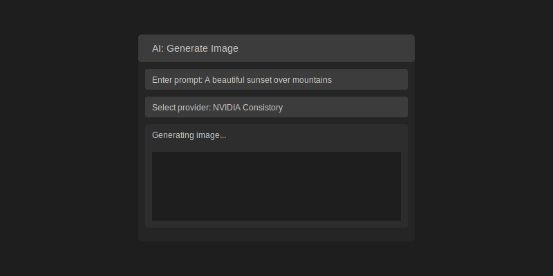
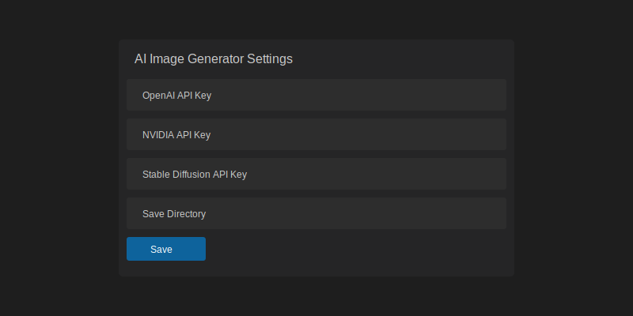

# AI Image Generator for VS Code

Generate AI-powered images directly within Visual Studio Code using multiple leading AI providers.

## Features

- 🎨 Multi-Provider Support:
  - OpenAI DALL-E (Paid)
  - Stable Diffusion (Paid)
  - Together AI (Paid)
  - NVIDIA Consistory (Paid)
  - AirForce (Free)
  - Replicate (Paid)

- 🚀 Smart Prompt Enhancement:
  - Optional Groq AI-powered prompt enhancement
  - Improved details for lighting, atmosphere, and composition
  - Uses advanced llama3-70b-8192 model

- 📸 Image Generation Options:
  - Multiple output formats (webp, png, jpeg)
  - Custom save directory
  - File overwrite protection
  - Performance tracking

## Screenshots

### Generate Images


### Configure Settings


## Installation

1. Install the extension from the VS Code marketplace
2. Configure your API keys using the command palette
3. Start generating images!

## Requirements

- Visual Studio Code ^1.85.0
- Node.js and npm installed
- API keys for paid providers (optional)

## Configuration

### API Keys

Configure your API keys using the "AI: Configure API Keys" command:

1. OpenAI API Key (for DALL-E)
2. Stable Diffusion API Key
3. Together AI API Key
4. NVIDIA API Key
5. Groq API Key (optional - for prompt enhancement)
6. Replicate API Token

You can also configure them directly in VS Code settings:

```json
{
  "ai-image-generator.openaiApiKey": "your-key",
  "ai-image-generator.replicateApiToken": "YOUR_REPLICATE_TOKEN",
  "ai-image-generator.stableDiffusionApiKey": "your-key",
  "ai-image-generator.togetherApiKey": "your-key",
  "ai-image-generator.nvidiaApiKey": "your-key",
  "ai-image-generator.groqApiKey": "your-key",
  "ai-image-generator.saveDirectory": "path/to/save/dir"
}
```

## Usage

1. Open the command palette (Ctrl+Shift+P / Cmd+Shift+P)
2. Type "AI: Generate Image"
3. Select your preferred provider
4. Enter your prompt
5. Optionally enhance your prompt with Groq AI
6. Choose image format and filename
7. Your image will be generated and saved!

### Provider-Specific Features

#### OpenAI DALL-E
- High-quality image generation
- Consistent results
- Professional-grade outputs

#### Stable Diffusion
- WebP format support
- Configurable generation steps
- Advanced image parameters

#### Together AI
- Fast generation
- FLUX.1-schnell model
- Efficient processing

#### NVIDIA Consistory
- Smart prompt parsing
- Scene composition
- Professional photo-realistic results

#### AirForce (Free)
- No API key required
- Quick results
- Great for testing

#### Replicate (recraft-v3)
- High-quality image generation
- Custom style support
- Flexible size options
- Fast generation times

### Prompt Enhancement

The Groq AI prompt enhancement feature can improve your results by:
- Adding specific details about lighting
- Enhancing atmosphere descriptions
- Improving composition details
- Making prompts more effective

Example:
- Original: "a cat in garden"
- Enhanced: "a fluffy orange cat sitting gracefully in a sunlit garden with blooming flowers, soft natural lighting, shallow depth of field, golden hour atmosphere"

## Troubleshooting

### Common Issues and Solutions

#### General Issues

1. **Extension Not Loading**
   - Check VS Code version compatibility (requires ^1.85.0)
   - Try reloading VS Code (`Ctrl+R` or `Cmd+R`)
   - Verify extension installation in Extensions panel

2. **API Key Issues**
   - Ensure all required API keys are properly configured
   - Check for leading/trailing spaces in API keys
   - Verify API key permissions and quotas
   - Try re-entering the API keys

3. **Image Generation Fails**
   - Check internet connectivity
   - Verify API provider status
   - Ensure prompt meets provider guidelines
   - Check API usage limits

### Performance Optimization

1. **Faster Generation**
   - Use optimal image sizes
   - Keep prompts concise
   - Use specific styles
   - Avoid complex prompt enhancement

2. **Better Results**
   - Use clear, detailed prompts
   - Specify artistic style
   - Enable prompt enhancement for important generations
   - Follow style-specific best practices

3. **Resource Usage**
   - Monitor API usage
   - Use appropriate image sizes
   - Cache frequently used images
   - Clean up temporary files

### Debug Mode

Enable debug mode for detailed logs:
```json
{
    "ai-image-generator.debug": true
}
```

Debug logs will show:
- API requests and responses
- Generation parameters
- Performance metrics
- Error details

### Getting Help

1. **Check Documentation**
   - Review README
   - Check CHANGELOG for known issues
   - Visit provider documentation

2. **Common Solutions**
   - Clear VS Code cache
   - Update extension
   - Verify dependencies
   - Check network connectivity

3. **Report Issues**
   - Provide error messages
   - Include debug logs
   - Describe reproduction steps
   - Specify provider and settings

### Best Practices

1. **API Management**
   - Rotate API keys regularly
   - Monitor usage limits
   - Keep keys secure
   - Use environment variables

2. **Prompt Writing**
   - Be specific and clear
   - Include style details
   - Use appropriate length
   - Follow provider guidelines

3. **Configuration**
   - Use recommended settings
   - Test in isolation
   - Backup configurations
   - Update regularly

## Error Handling

The extension includes comprehensive error handling:
- API key validation
- Provider-specific error messages
- Network error recovery
- File system error handling

## Performance

Each provider includes performance tracking:
- Generation time logging
- Response time monitoring
- Success rate tracking

## Security

- API keys are stored securely in VS Code settings
- No sensitive information in logs
- Secure image handling

## Contributing

1. Fork the repository
2. Create your feature branch
3. Commit your changes
4. Push to the branch
5. Create a Pull Request

## License

This project is licensed under the MIT License - see the [LICENSE](LICENSE) file for details.

## Acknowledgments

Special thanks to:
- OpenAI for DALL-E API
- Stability AI for Stable Diffusion
- Together AI for their SDK
- NVIDIA for Consistory API
- Groq AI for prompt enhancement
- AirForce for free image generation
- Replicate for recraft-v3 API

## Privacy

This extension:
- Does not collect user data
- Does not share API keys
- Only communicates with specified AI providers
- Stores configuration locally

For more details, see our [Privacy Policy](SECURITY.md#privacy).
